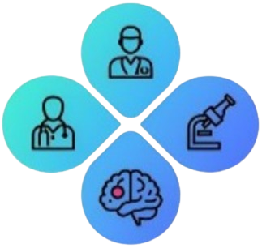

<div align="center">
  
  <h1 align="center">🧠 NeuroNexus</h1>
  <p align="center">
    <strong>AI-Powered Healthcare Platform</strong>
    <br />
    Connecting Patients · Labs · Doctors · AI Diagnostics
  </p>

  <p align="center">
    
    
    
    
    
    
    <br />
    
  </p>
</div>

---

## 📋 Table of Contents

- [Overview](#-overview)
- [System Architecture](#-system-architecture)
- [User Roles](#-user-roles)
- [Web Platform (This Repo)](#-web-platform)
- [Mobile App (Kotlin)](#-mobile-app-kotlin)
- [Brain Tumor Detection Model](#-brain-tumor-detection-model)
- [Firebase Integration](#-firebase-integration)
- [Features](#-features)
- [Getting Started](#-getting-started)
- [Environment Variables](#-environment-variables)
- [Project Structure](#-project-structure)
- [Database Structure](#-database-structure)
- [Deployment](#-deployment)
- [Tech Stack](#-tech-stack)

---

## 🩺 Overview

**NeuroNexus** is a complete healthcare ecosystem comprising three integrated components:

| Component | Tech | Purpose |
|-----------|------|---------|
| **🌐 Web Portal** | React + Vite + Firebase | Admin dashboard: manage labs & doctors, approve/reject registrations, view appointments |
| **📱 Mobile App (Patient)** | Kotlin (Android) | Patient registration, booking appointments, viewing reports, **symptom-based risk analysis** |
| **📱 Mobile App (Doctor)** | Kotlin (Android) | Doctor registration, manage patients, **MRI scanner & AI diagnosis**, review reports |
| **🧬 AI Models** | ResNet-18 + U-Net (Hosted on Hugging Face) | Classifies brain MRI scans for tumor presence + type, segments tumor for size & location |

All three components share a **single Firebase Realtime Database**, making the ecosystem fully synchronized.

---

## 🏗 System Architecture

```
┌─────────────────────────────────────────────────────────────────────────┐
│                         Firebase (Shared Backend)                        │
│  ┌─────────────┐  ┌──────────────────┐  ┌───────────────────────────┐  │
│  │  Firebase    │  │  Firebase        │  │  Hugging Face Inference  │  │
│  │  Auth        │  │  Realtime DB     │  │  API (Model Hosting)     │  │
│  └─────────────┘  └──────────────────┘  └───────────────────────────┘  │
└─────────────────────────────────────────────────────────────────────────┘
         ▲                       ▲                            ▲
         │                       │                            │
    ┌────┴────┐           ┌──────┴──────┐              ┌──────┴──────┐
    │  Web    │           │  App       │              │  ResNet-18  │
    │  Admin  │◄─────────►│  Patient  │   HTTP/REST  │  + U-Net    │
    │         │  Real-time│  Doctor   │              │  (Hugging   │
    │         │   sync    │  (Mobile) │              │   Face)     │
    └─────────┘           └───────────┘              └─────────────┘
```

### Data Flow

1. **Doctor registers** on mobile app → Firebase stores info → Admin approves/rejects/deactivates on web
2. **Lab registers** on web → Firebase stores lab info → Admin approves/rejects/deactivates
3. **Patient registers** on mobile app → Firebase stores patient info
4. **Patient uses symptom risk analyzer** on mobile → answers questionnaire → static rule-based assessment → advises whether to consult a doctor
5. **Patient books appointment** (with lab or doctor) on mobile → Booking appears in web admin
6. **Doctor captures/selects MRI** on mobile → Image sent to **Hugging Face Inference API** → **ResNet-18** classifies first → if tumor found → **U-Net** segments for size & location → Results stored in Firebase
7. **Doctor reviews MRI result** on mobile → Confirms diagnosis, adds notes
8. **Lab uploads test report** on web → Patient gets notification on mobile
9. **All notifications** sync in real-time across web and mobile

---

## 👥 User Roles

| Role | Web Access | Mobile Access | Managed By |
|------|-----------|---------------|------------|
| **Admin** | Full web dashboard | — | Self-registered (seeded) |
| **Lab** | Lab portal (tests, bookings, reports) | — | Admin approves/rejects/deactivates |
| **Doctor** | — | Full mobile app (registration, manage patients, MRI scanner, AI diagnosis) | Admin approves/rejects/deactivates via web |
| **Patient** | — | Mobile app (registration, bookings, symptom risk analysis, reports) | Self-registered |

### Account Status Workflow (Lab & Doctor)

```
Sign Up
   │
   ▼
 Pending ──► Admin Approves ──► Active
   │                                │
   ├── Admin Rejects ──► Rejected   │
   │       │                        │
   │       ▼                        ├── Admin Deactivates ──► Deactivated
   │   Can fix & resubmit           │       │
   │                                │       ├── Appeals ──► Admin Reactivates or Dismisses
   │                                │       │
   └── (stays pending)              └── Admin blocks ──► Blocked (cannot login)
```

---

## 🌐 Web Platform

The **Web Portal** is a React single-page application with dashboards for Admin, Lab, and Doctor registration management.

### 👑 Admin Dashboard

| Page | Description |
|------|-------------|
| `/dashboard` | Real-time stats (labs, doctors, patients, bookings), recent activity feed, **lab appeal alerts** with dismiss/reactivate |
| `/labs/pending` | Review & approve/reject lab registrations |
| `/labs/approved` | Manage active/deactivated labs, **deactivate with reason**, reactivate |
| `/labs/rejected` | View rejected lab applications |
| `/doctors/pending` | Review & approve/reject doctor registrations |
| `/doctors/approved` | Manage active/deactivated doctors |
| `/doctors/rejected` | View rejected doctor applications |
| `/doctors/categories` | Manage doctor specialization categories |
| `/patients` | View & manage all patients |
| `/bookings` | View all appointments across labs and doctors |
| `/payments` | Payment tracking |
| `/complaints` | Manage complaints with admin responses |
| `/notifications` | Full notification center |
| `/profile` | Admin profile management (name, email, photo) |

### 🔬 Lab Dashboard

| Page | Description |
|------|-------------|
| `/lab/dashboard` | Lab-specific stats, recent activity |
| `/lab/tests` | CRUD for test catalog |
| `/lab/bookings` | View & manage patient bookings |
| `/lab/reports` | **Upload lab reports** — 4-step modal |
| `/lab/payments` | Payment tracking |
| `/lab/complaints` | Submit & track complaints |
| `/lab/notifications` | Notification center |
| `/lab/profile` | Lab profile editing, account deletion |
| `/lab/fix-registration` | Fix rejected registration |
| `/lab/suspended` | **Appeal deactivation** — view admin reason, submit appeal, contact admin |

### Auth Flows
- **Approved** → full access
- **Pending** → cannot sign in ("under review")
- **Rejected** → redirected to fix-registration page
- **Deactivated** → redirected to suspended page (can appeal)
- **Blocked** → cannot sign in

---

## 📱 Mobile App (Kotlin)

The **Android app** (separate repository) has two separate mobile applications — one for patients and one for doctors.

### Patient Mobile App Features

| Feature | Description |
|---------|-------------|
| Registration & Login | Firebase Auth |
| Browse Doctors & Labs | View profiles, specializations |
| Book Appointments | Choose lab tests or doctor consultation |
| **Symptom Risk Analysis** | Answers a questionnaire about symptoms → static rule-based risk assessment → advises whether to consult a doctor |
| View Reports | Download lab & doctor reports |
| Notifications | Real-time updates for appointments & reports |

### Doctor Mobile App Features

| Feature | Description |
|---------|-------------|
| Registration & Login | Firebase Auth (approved by admin on web) |
| Manage Patients | View assigned patients, appointment history |
| **MRI Scanner & AI Diagnosis** | Capture or upload brain MRI → sends to Hugging Face API → receives tumor classification + segmentation results |
| Review AI Results | See ResNet-18 classification + U-Net segmentation, add medical notes |
| Appointment Management | View & manage patient bookings |
| Notifications | New booking & MRI result alerts |

> **Note:** The mobile app source code is in a separate repository.

---

## 🧬 Brain Tumor Detection Model

Two AI models are used in sequence, both hosted on **Hugging Face** and accessed via REST API from the mobile app.

### Model 1: Classification — ResNet-18

| Detail | Value |
|--------|-------|
| **Architecture** | ResNet-18 (pre-trained on ImageNet, fine-tuned) |
| **Task** | Multi-class classification |
| **Classes** | Glioma, Meningioma, Pituitary, No Tumor |
| **Input** | Brain MRI scans (224×224×3) |
| **Output** | Tumor type + confidence score |
| **Hosting** | Hugging Face Inference API |

### Model 2: Segmentation — U-Net

| Detail | Value |
|--------|-------|
| **Architecture** | U-Net |
| **Task** | Tumor segmentation (localization) |
| **Input** | Brain MRI scans (same as classification) |
| **Output** | Segmentation mask — tumor boundary, size, location coordinates |
| **Hosting** | Hugging Face Inference API |

### Inference Flow

```
Doctor captures/selects MRI on mobile app
                    │
                    ▼
          ┌─────────────────┐
          │  Preprocessing   │
          │  (resize 224×224,│
          │   normalize)     │
          └────────┬────────┘
                   │
                   ▼
          ┌─────────────────────────────────┐
          │   Hugging Face Inference API    │
          │                                 │
          │   ┌──────────────────────┐      │
          │   │    ResNet-18         │      │
          │   │  (Classification)    │      │
          │   └──────────┬───────────┘      │
          │              │                  │
          │     ┌────────┴────────┐         │
          │     ▼                 ▼         │
          │  Tumor             No Tumor     │
          │  Found             Detected     │
          │     │                 │         │
          │     ▼                 │         │
          │  ┌──────────┐        │         │
          │  │  U-Net   │        │         │
          │  │Segmen-   │        │         │
          │  │tation    │        │         │
          │  └────┬─────┘        │         │
          │       │              │         │
          └───────┼──────────────┼─────────┘
                  │              │
                  ▼              ▼
         ┌──────────────┐  ┌──────────┐
         │ Tumor type   │  │ "No      │
         │ (Glioma,     │  │  tumor   │
         │  Meningioma, │  │  detected"│
         │  Pituitary)  │  └──────────┘
         │ Size: 3.2cm³ │
         │ Location:    │
         │ Left frontal │
         │ lobe         │
         └──────┬───────┘
                │
                ▼
         ┌─────────────────┐
         │  Store results  │
         │  in Firebase    │
         │  Notify doctor  │
         └─────────────────┘
```

**Key Logic:** The MRI is first passed through ResNet-18. If no tumor is detected, it returns "No tumor detected" immediately without invoking U-Net. Only if a tumor is found does the pipeline proceed to U-Net for segmentation (size, location, boundaries).

The model weights and training scripts are in a separate repository. This web repo consumes results stored in Firebase by the mobile app.

---

## 🔥 Firebase Integration

Everything is connected through a single **Firebase Realtime Database** instance.

### Authentication (`firebase/auth`)
- **Email/Password** for Admin, Lab, Doctor, and Patient accounts
- Role-based access control via database `users/{uid}/role`
- Account status checks during login (blocked, deactivated, rejected, pending)
- `sendPasswordResetEmail()` for forgot password

### Realtime Database Structure
```
/
├── users/{uid}              # All user accounts (role, status, email)
├── admin/{uid}              # Admin profiles
├── labs/{uid}               # Lab profiles + registrationStatus + appeal data
├── doctors/{uid}            # Doctor profiles + registrationStatus
├── patients/{uid}           # Patient profiles (from mobile app)
├── appointments/{id}        # Bookings with tests[] sub-node
├── tests/{testId}           # Global test catalog
├── labReports/{labId}       # Reports uploaded by labs
├── medical_records/{uid}/lab_reports/  # Reports linked to patients
├── notifications/{uid}      # Per-user notifications
├── complaints/{id}          # Complaints & admin responses
├── payments/{id}            # Payment records
├── doctorCategories/        # Doctor specialization categories
└── feedback/                # Patient feedback
```

### Cloudinary
All file uploads (profile pictures, lab logos, license docs, lab reports) go through **Cloudinary** — supports images (JPEG, PNG) and PDFs.

---

## ✨ Features

### ✅ Implemented

**🔐 Authentication & Role Management**
- Admin, Lab, Doctor, Patient roles
- Registration with status workflow (pending → approved/rejected → deactivated)
- Forget password with Firebase reset email
- Account deletion with reauthentication

**🏥 Lab Management**
- Registration with approval workflow
- Test catalog CRUD
- Booking management
- Lab report upload & sharing (4-step modal, per-test upload)
- Deactivation with reason + appeal system

**👨‍⚕️ Doctor Management**
- Registration with approval workflow
- 16 specialization categories (Cardiology, Dermatology, etc.)
- Category CRUD for admin
- Table & card view modes

**📊 Dashboards**
- Admin: Real-time stats, recent activity feed, lab appeal alerts
- Lab: Lab-specific activity, booking stats

**🔔 Notification System**
- Real-time notifications for all actions
- Mark read, mark all read, clear all, delete individual
- Separate centers for admin and lab

**📱 Mobile App Sync**
- Shared Firebase DB with separate Kotlin Android apps (Patient + Doctor)
- Appointments, reports, notifications sync in real-time
- MRI scan results from Hugging Face stored in Firebase

**🧠 AI Integration (Doctor Mobile App)**
- **ResNet-18** for brain tumor classification (Glioma, Meningioma, Pituitary, No Tumor)
- Only proceeds to **U-Net segmentation** if tumor is detected
- U-Net provides tumor size, location, and boundary coordinates
- Models hosted on **Hugging Face Inference API**
- Results stored in Firebase, reviewed by doctor on mobile

**🩺 Patient Symptom Risk Analysis (Patient Mobile App)**
- Static questionnaire about symptoms
- Rule-based risk assessment
- Advises patient whether to consult a doctor
- Not AI-based — predefined question scoring

**🎨 UI/UX**
- Custom reusable alert system
- Fully responsive landing page (400px–1200px+)
- Bootstrap 5.3 with custom theme

---

## 🚀 Getting Started

### Prerequisites
- Node.js 18+
- npm or yarn
- Firebase project (with Auth + Realtime Database enabled)
- Cloudinary account

### Installation

```bash
# 1. Clone the repository
git clone https://github.com/your-username/neuronexus-web.git
cd neuronexus-web/NeuroNexus

# 2. Install dependencies
npm install

# 3. Set up environment variables
# Create .env in the root (see Environment Variables section)

# 4. Start development server
npm run dev
```

The app will open at `http://localhost:5173`.

### Build for Production

```bash
npm run build
npm run preview  # Preview production build locally
```

---

## 🔐 Environment Variables

Create a `.env` file in the project root:

```env
VITE_FIREBASE_API_KEY=your_api_key
VITE_FIREBASE_AUTH_DOMAIN=your_project.firebaseapp.com
VITE_FIREBASE_DATABASE_URL=https://your_project-default-rtdb.firebaseio.com
VITE_FIREBASE_PROJECT_ID=your_project_id
VITE_FIREBASE_STORAGE_BUCKET=your_project.appspot.com
VITE_FIREBASE_MESSAGING_SENDER_ID=your_sender_id
VITE_FIREBASE_APP_ID=your_app_id
VITE_FIREBASE_MEASUREMENT_ID=your_measurement_id
VITE_CLOUDINARY_CLOUD_NAME=your_cloud_name
VITE_CLOUDINARY_UPLOAD_PRESET=your_upload_preset
```

### Firebase Setup Steps
1. Go to [Firebase Console](https://console.firebase.google.com/)
2. Create a new project
3. Enable **Authentication** → Sign-in method → Email/Password
4. Enable **Realtime Database** → Create in test mode
5. Go to Project Settings → Web app → Copy config
6. Create a Cloudinary account → Get cloud name + create unsigned upload preset

---

## 📁 Project Structure

```
NeuroNexus/
├── public/                     # Static assets (logo)
├── src/
│   ├── components/
│   │   ├── Alert/              # Reusable alert/modal component
│   │   ├── Navbar/             # Admin & Lab navbars
│   │   ├── ProtectedRoute/     # Route guards (admin, lab)
│   │   └── Sidebar/            # Admin & Lab sidebars
│   ├── context/
│   │   └── Firebase.jsx        # ALL Firebase operations (1870+ lines)
│   ├── hooks/                  # Alert state management hook
│   ├── pages/
│   │   ├── admin/
│   │   │   ├── Auth/           # Login, forget password
│   │   │   ├── Dashboard/      # Dashboard + LabAppealAlerts
│   │   │   ├── Bookings/       # All appointments
│   │   │   ├── Labs/           # Pending/Approved/Rejected/Details
│   │   │   ├── Doctors/        # Pending/Approved/Rejected/Details/Categories
│   │   │   ├── Patients/       # Patient management
│   │   │   ├── Payments/       # Payment tracking
│   │   │   ├── Complains/      # Complaint management
│   │   │   ├── Notifications/  # Notification center
│   │   │   └── Profile/        # Admin profile
│   │   ├── Lab/
│   │   │   ├── Auth/           # Login, signup, forget, fix-registration, suspended
│   │   │   ├── Dashboard/      # Lab dashboard
│   │   │   ├── Test/           # Test CRUD
│   │   │   ├── Bookings/       # Booking management
│   │   │   ├── Reports/        # Lab report upload
│   │   │   ├── Payments/       # Payment view
│   │   │   ├── Complaints/     # Complaint system
│   │   │   ├── Notifications/  # Notification center
│   │   │   └── Profile/        # Lab profile + account deletion
│   │   └── Landing/            # Public marketing page
│   ├── styles/theme.css        # Global theme
│   └── utils/
│       └── uploadCloudinary.js # Cloudinary upload utility
├── .env                        # Environment variables
├── index.html                  # Entry HTML (Bootstrap 5 CDN)
├── package.json                # Dependencies & scripts
└── vite.config.js              # Vite configuration
```

---

## 🗄 Database Structure

### Firebase Realtime Database Reference

| Path | Description | Written By |
|------|-------------|------------|
| `users/{uid}` | User metadata (role, status, email) | Web + Mobile |
| `admin/{uid}` | Admin profile | Web (Admin) |
| `labs/{uid}` | Lab profile + registrationStatus + appeal | Web (Lab + Admin) |
| `doctors/{uid}` | Doctor profiles + registrationStatus | Web (Admin seeds + manages) |
| `patients/{uid}` | Patient profiles | Mobile app |
| `appointments/{id}` | Bookings with `tests[]` sub-array | Mobile app |
| `tests/{testId}` | Global test catalog | Web (Lab) |
| `labReports/{labId}` | Lab reports | Web (Lab) |
| `medical_records/{uid}/lab_reports/` | Patient reports | Web (Lab) |
| `notifications/{uid}` | Per-user notifications | Web + Mobile |
| `complaints/{id}` | Complaints & responses | Web (Lab + Admin) |
| `doctorCategories/` | Doctor specializations | Web (Admin) |
| `mri_results/{id}` | AI diagnosis from Hugging Face | Mobile app |

---

## 🌍 Deployment

### Web (Vite Build)
```bash
npm run build
# Deploy the dist/ folder to:
#   - Firebase Hosting
#   - Vercel
#   - Netlify
#   - Any static hosting
```

### Firebase Hosting
```bash
npm install -g firebase-tools
firebase login
firebase init hosting  # Select dist/ as public directory
firebase deploy
```

### Mobile App
The Kotlin Android app connects to the **same Firebase project** — no additional server setup needed.

---

## 🛠 Tech Stack

### Frontend (Web)
- **React 19** — UI framework
- **Vite 7** — Build tool & dev server
- **React Router 6** — Client-side routing
- **Bootstrap 5.3** (CDN) — CSS framework
- **Firebase JS SDK 12** — Auth + Realtime Database
- **Cloudinary** — File upload & storage

### Mobile
- **Kotlin** — Android apps (Patient + Doctor, separate APKs)
- **Firebase Android SDK** — Auth + Database
- **Hugging Face Inference API** — AI model calls (via HTTP)

### Machine Learning
- **ResNet-18** — Brain MRI tumor classification (type detection)
- **U-Net** — Brain MRI tumor segmentation (size + location)
- **Hugging Face** — Model hosting & inference API

### Backend (Serverless)
- **Firebase Authentication** — User management
- **Firebase Realtime Database** — All data storage & real-time sync
- **Cloudinary** — Image & PDF storage
- **Hugging Face API** — AI model inference

---

<div align="center">
  <hr />
  <p>
    Built with ❤️ for better healthcare<br />
    <strong>NeuroNexus</strong> — AI-Powered Healthcare Platform
  </p>
</div>
